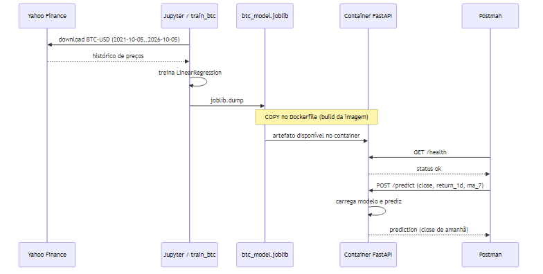

# Atividade Ponderada M7 — Predição de BTC com Docker


## Arquitetura UML

Esse diagrama representa o fluxo de dados e mostra como a arquitetura da informação está posicionada e se comportando dentro da estrutura do modelo e maneira como o docker está sendo utilizado para a melhora e facilitação das necessidades do modelo.

### Diagrama de sequência


Fontes Mermaid: [`docs/arquitetura-componentes.mmd`](docs/arquitetura-componentes.mmd) · [`docs/arquitetura-sequencia.mmd`](docs/arquitetura-sequencia.mmd)

### Componentes

- Notebook `notebooks/train_btc.ipynb` ou `scripts/train_btc.py`
- `models/btc_model.joblib`
- `backend/app.py` + `backend/Dockerfile`
- Postman

### Como o modelo chega ao container

O resultado do treinamento é passado para uma imagem usando `COPY models/btc_model.joblib` e cada vez que o modelo for atualizado ou retreinado será necessário um rebuild.

## Dados (Yahoo Finance)

Os dados são puxados via dependencia no vscode, yfinance, que permite extrair os dados direto para o vscode já para csv para que possam ser usados.

código abaixo foi gerado com o cursor para fazer a requisição dos dados sobre o BTC nos ultimos 5 anos:

```python
import yfinance as yf

# BTC-USD de 05/10/2021 até 05/10/2026
# (no yfinance, end é exclusivo → usa 2026-10-06 para incluir 05/10/2026)
data = yf.download("BTC-USD", start="2021-10-05", end="2026-10-06", auto_adjust=True)

# Exportar para arquivo CSV
data.to_csv("data/btc_usd_dados.csv")
```
Os dados são de 05/10/2021 há 06/10/2026, eles seguem a divisão de mudança diária.

## Modelo

O modelo tem como objetivo de predição o valor de fechamento da BTC no dia seguinte usando Regressão Linear para ffazer a previsão do preço de fechamento do BTC no dia de amanhã, foi feita a divisão dos dados usando 80% para treino e 20% para a validação e sem embaralhamento dos dados.


Métricas observadas no último treino : MAE ≈ 1308.96 USD no conjunto de teste; R² ≈ 0.9826 .


### Testar no Postman


health — `GET http://localhost:8000/health`

Exemplo de resposta observada:
```json
{"status":"ok","model_loaded":true,"model_path":".../models/btc_model.joblib"}
```

predict — `POST http://localhost:8000/predict`  
Header: `Content-Type: application/json`

Body:
```json
{
  "close": 65000,
  "return_1d": 0.01,
  "ma_7": 64000
}
```


### Méetricas do Modelo

Métricas resultantes do treinamento e observadas Após os testes

Treino: 1456 | Teste: 364
MAE (teste): 1308.46
R2 (teste): 0.9826
Coeficientes: {'close': np.float64(0.9806948288229312), 'return_1d': np.float64(-1542.3550245152849), 'ma_7': np.float64(0.020177192985199155)}
Intercepto: 3.6566079597327303

## Decisões técnicas

Fonte de dados: Yahoo Finance
Moeda: BTC-USD
Objetivo de Previsão: Preço de fechamento de amanhã
Modelo: Regressão Linear
Artefato: joblib somado ao COPY atende ao que é preciso sem o uso de Compose que preferi não usar por não ter tanta confiança usando.
Backend: FastAPI com `/health` + `/predict` de facil identificação para o Postman.
UI: PostMan para visualização de funcionamento.

## Devlog

### Dados

Fonte: Yahoo Finance (yfinance)
Ativo: BTC-USD
Período: 05/10/2021 → 05/10/2026 
Frequência: diária
Saída: data/btc_usd_dados.csv

Eu usei os dados do Yahoo finance porque achei essa dependencia que permitia puxar direto para csv, o periodo eu escolhi porque de 5 anos porque acreditei que fosse um bom tempo, e a frequencia diária eu usei porque achei mais interessante já que é uma criptomoeda e é muito volatil.

### Problema de ML

Horizonte: prever o close de amanhã
Features: close, return_1d, ma_7
Split: 80/20 cronológico (sem shuffle)

### Modelo

Tipo: regressão linear (equivalente a LinearRegression)
Implementação: numpy.linalg.lstsq (fallback porque sklearn/scipy falharam no Python 3.14 local)
Artefato: models/btc_model.joblib (coef, intercept, feature_cols)

### Treino

Ambiente: Jupyter notebook (notebooks/train_btc.ipynb)
Alternativa prática: scripts/train_btc.py

### Inferência / Docker

Backend: FastAPI (GET /health, POST /predict)
Transferência do modelo: COPY no Dockerfile
Cliente: Postman

eu usei o COPY porque não queria ter que usar Compose então busquei um jeito de contornar essa decisão.

Os códigos de treinamento e modelo foram gerados com AI, mas o que eu entendi é que ele no treinamento usando NumPy ele faz calculos matemáticos usando varias datas passadas e gera uma variavel dependente de dados passados para tentar adivinhar qual o valor de fechamento do BTC amanhã então usando o Média de erro Absoluto.
